# Описание проекта

## Task 1

### Swagger проекта:
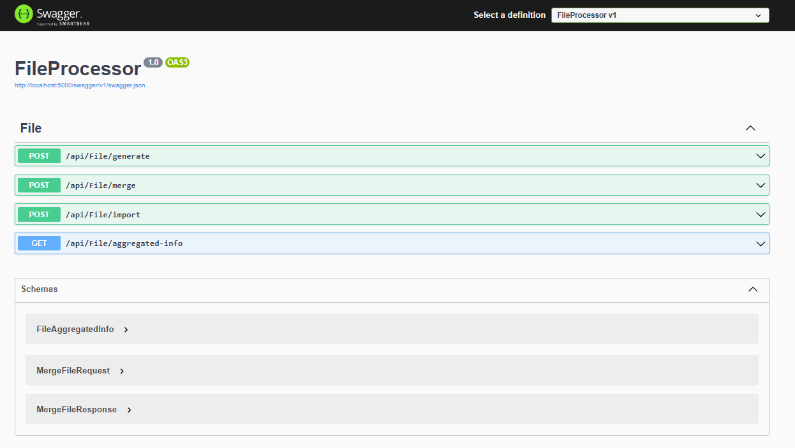

### Генерация файлов:

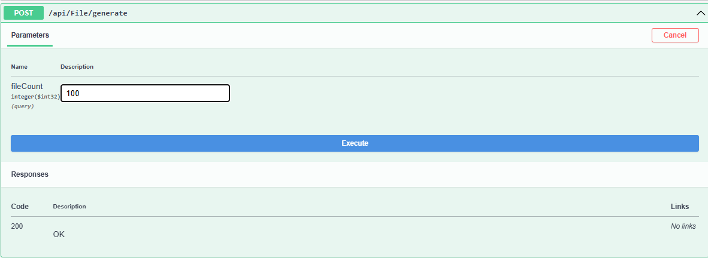

### Результат генерации:

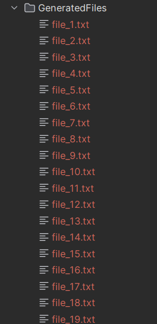

### Содержимое файлов:

### Объединение файлов:

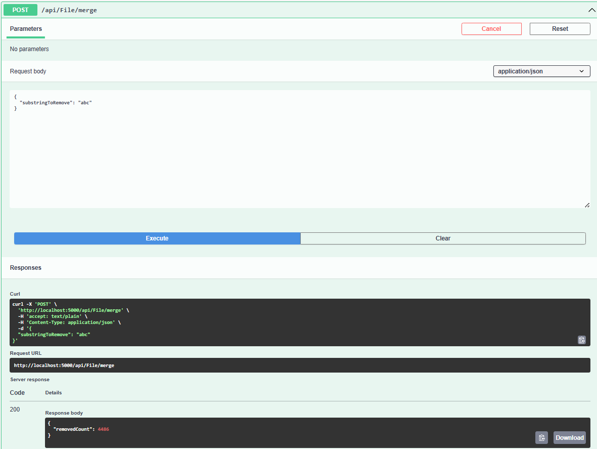

### Импорт файлов:

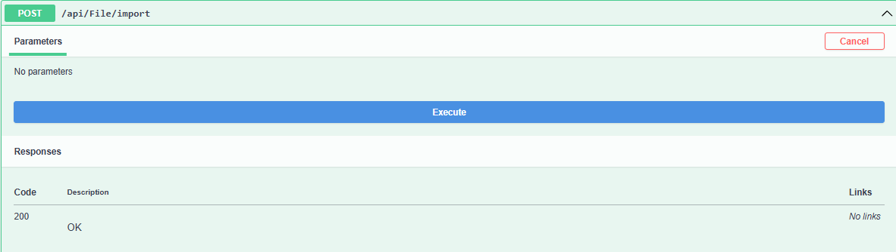

### Вывод прогресса:

### Данные в БД:

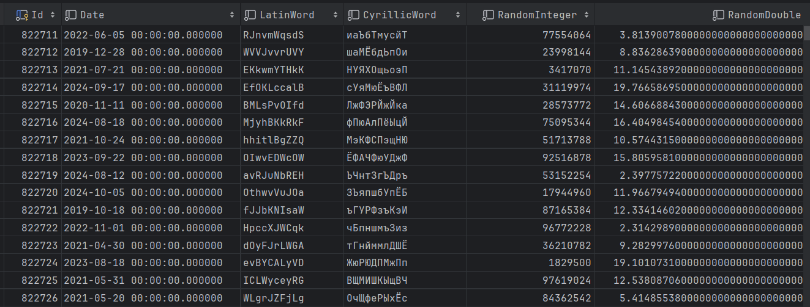

### Хранимая процедура:

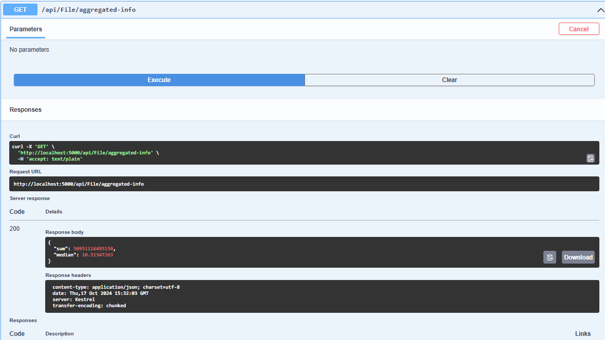

### Код хранимой процедуры:

## Task 2

### Страница с загруженными файлами:

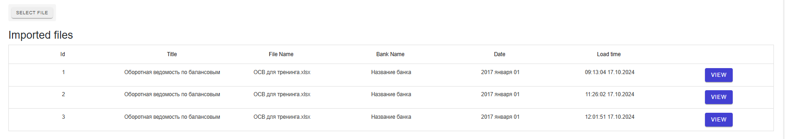

### Импорт файла:

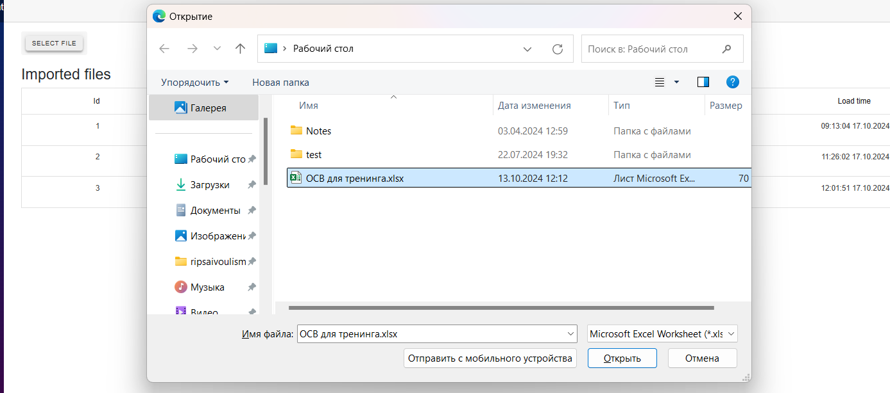

### Результат загрузки файла:

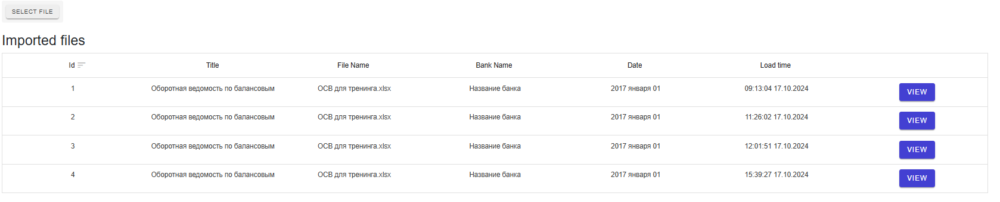

### Просмотр содержимого файла:

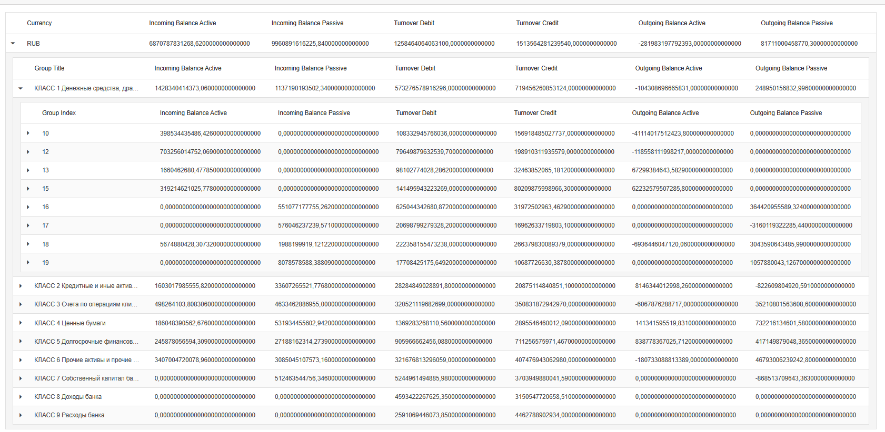
