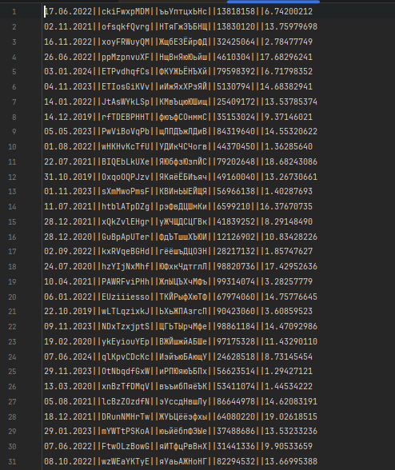
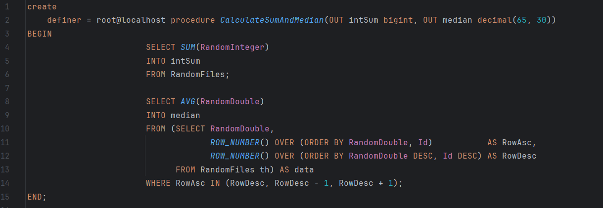

# Описание проекта

## Task 1

### Swagger проекта:

### Генерация файлов:

### Результат генерации:

### Содержимое файлов:

### Объединение файлов:

### Импорт файлов:

### Вывод прогресса:

### Данные в БД:

### Хранимая процедура:

### Код хранимой процедуры:

## Task 2

### Страница с загруженными файлами:

### Импорт файла:

### Результат загрузки файла:

### Просмотр содержимого файла:

